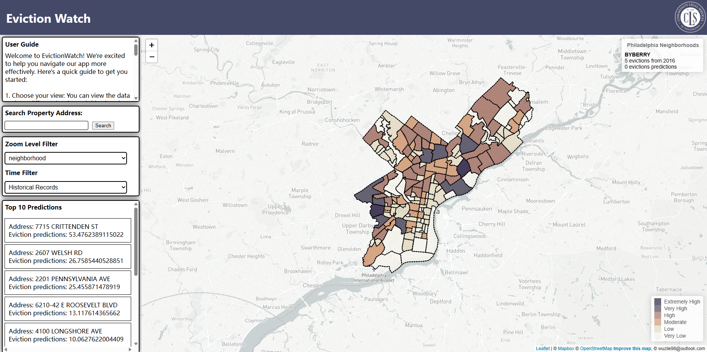

# EVICTION WATCH 
## A MUSA Practicum Project
Author: Zile Wu & Chris Michael

This project has been developed in collaboration with the University of Pennsylvania’s Master of Urban Spatial Analytics Spring 2023 Practicum (MUSA 801), instructed by Michael Fichman and Matt Harris. We extend our sincere gratitude to Lauren Parker of Community Legal Services, Jonathan Pyle from Philadelphia Legal Assistance, and Steven Suffian of Who Owns Philadelphia. Their invaluable contributions have been instrumental in bringing this project to fruition.

## Main functions
The dashboard is divided into two main parts, the map part and the dashboard part.

For the Map Part:
- Different colot represent different level of evictions.
- When you hover over the different neighborhoods, it will show you specific information about each neighborhood.
- When you use your mouse wheel to zoom in, It will show you the parcels
- You can click on each parcels to see detailed info about that parcel.

For the Dashboard part:
- You can see the user guide on the top left.
- You can search the sepcific property address in the search bar. And the map will zoom to the specific location.
- You can filter the map by different data layers (neighborhood layer/ parcel layer) or (Historical Records/ Predictions)
- On the bottonleft you can see the top 10 properties which has the highest risk of eviction.

Enjoy it！

Any comments, suggestions please reach out to wuzile98@outlook.com

Zile Wu 
05/08/2023
